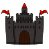
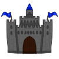
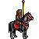
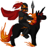
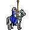
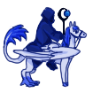
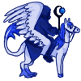

# pyqt_boardgame

Local multiplayer board game inspired by Heroes of Might and Magic. 


## Rules

Two players move on the board until one conquers anothers' castle. Player can have up to three heroes on the board and can move only one each turn. 

## Treasures


Each time player moves to the tile with a treasure icon, they have a random chance to either get a free reward or have to fight with a random set of monsters. 

## Battles

Players can attack each others when they are on the same tile. In order to do this - they have to press "Attack" button. They can also try to conquer one's castle. 

Every hero has his own units. Every time you visit castle you can add units to your team. 

Every battle is based on roll die results. The better is heroes' team, the bigger are chances to win.

## Upgrading castle

 

Both players start with a few weak units in the castle and one 5-level unit, which can not be added to the heroes' team unless player reaches maximum level of the castle. This way the opponent can not defeat another player too early. Each upgrade costs player certain amount of gold, but it also lets player purchase better units.

## Difficulty level

Each week the amount and the level of monsters that can be met on treasure tiles is getting more and more difficult, so it is really important to upgrade castle as soon as possible and buy better units

## Heroes

Player can buy another hero anytime you want as long as they can afford paying 1500 gold for it. Hero always starts on the castle tile with a few weak, default units. If a player does not have any gold and heroes left - they need to wait till the start of a new week to receive money. 
There are three heroes available for each player

  

  

## Requirements

* Python 3.7
* PyQt 5

## How to run the game?
```bash
python main.py
```

## Credits

Heroes, castles and treasures were drawn by [Daria Lasecka](https://github.com/darialasecka) exclusively for this game.

Free photos were found on [Pexels](https://www.pexels.com/) and free vector graphics are from [Pixabay](https://pixabay.com/)

The game was created for Human Computer Interaction classes on university. 